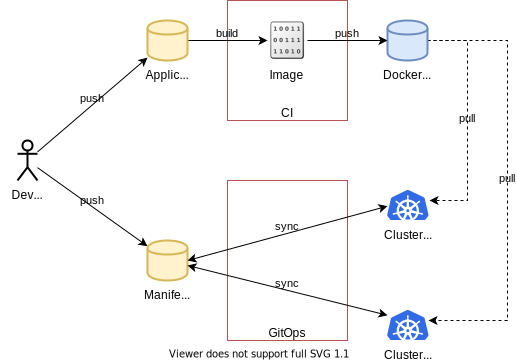
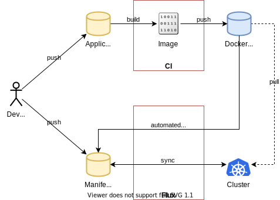

# flux-continuous-deployment-demo

This is a demo of Continuous Deployment with Flux using the feature of [automated deployment of new container images](https://docs.fluxcd.io/en/stable/references/automated-image-update.html).


## Introduction

In a typical GitOps flow, you need to build a new Docker image and update the manifest to deploy the application.



In continuous deployment flow, you only need to build a new Docker image. Flux will update the manifest when a newer image is found.




## Demo

This demo uses the following components:

1. Application repository: https://github.com/int128/hellopage
1. Google Cloud Build
1. Google Container Registry: https://gcr.io/int128-1313/github.com/int128/hellopage
1. Manifest repository: https://github.com/int128/flux-continuous-deployment-demo

You can use your own components by replacing URLs in [`helmfile.yaml`](helmfile.yaml).

This demo will deploy the following components:

1. Demo app (Deployment, Service and Ingress)
1. Contour (Ingress controller)
1. Flux

You can access the demo app via Ingress on http://hellopage-127-0-0-1.nip.io:30080.


### Set up

You need to install the following tools:

- Docker
- Kind
- Helmfile
- fluxctl

Create a cluster and deploy the demo app.

```sh
make
```

Deploy Flux and Contour.

```sh
export KUBECONFIG=output/kubeconfig.yaml

helmfile sync
```

Open http://hellopage-127-0-0-1.nip.io:30080. Make sure the demo app shows up.

Open https://github.com/int128/flux-continuous-deployment-demo/settings/keys and add the deploy key with write access.
You can get the deploy key as follows:

```console
% fluxctl identity
ssh-rsa ...
```

Make sure that Flux recognizes the deployment.

```console
% fluxctl list-workloads -n hellopage
WORKLOAD                        CONTAINER  IMAGE                                                       RELEASE  POLICY
hellopage:deployment/hellopage  app        gcr.io/int128-1313/github.com/int128/hellopage:dev-81f12fd  ready    automated

% fluxctl list-images -n hellopage
WORKLOAD                        CONTAINER  IMAGE                                           CREATED
hellopage:deployment/hellopage  app        gcr.io/int128-1313/github.com/int128/hellopage
                                           '-> dev-81f12fd                                 14 Jun 20 07:11 UTC
```

You can see Flux log for debug.

```sh
make logs-flux
```


### Update the application

Open https://github.com/int128/hellopage and create a commit.
Google Cloud Build will build an image and push it to GCR.

Flux will create a commit to this repository for updating the image tag of deployment.
You can see the image tags which Flux scans.

```console
% fluxctl list-images -n hellopage
WORKLOAD                        CONTAINER  IMAGE                                           CREATED
hellopage:deployment/hellopage  app        gcr.io/int128-1313/github.com/int128/hellopage
                                           '-> dev-7be21e9                                 15 Jun 20 01:52 UTC
                                               dev-81f12fd                                 14 Jun 20 07:11 UTC
```

You can see the new version within a minute.


### Troubleshoot

You can see Flux log for debug.

```sh
make logs-flux
```

When Flux found a newer image, it writes logs like:

```
ts=2020-06-15T01:53:47.6752392Z caller=images.go:17 component=sync-loop msg="polling for new images for automated workloads"
ts=2020-06-15T01:53:47.7193163Z caller=images.go:111 component=sync-loop workload=hellopage:deployment/hellopage container=app repo=gcr.io/int128-1313/github.com/int128/hellopage pattern=glob:* current=gcr.io/int128-1313/github.com/int128/hellopage:dev-81f12fd info="added update to automation run" new=gcr.io/int128-1313/github.com/int128/hellopage:dev-7be21e9 reason="latest dev-7be21e9 (2020-06-15 01:52:55.214282133 +0000 UTC) > current dev-81f12fd (2020-06-14 07:11:00.193482088 +0000 UTC)"
```

When Flux pushed a commit, it writes logs like:

```
ts=2020-06-15T01:53:47.7215553Z caller=loop.go:141 component=sync-loop jobID=d23d293c-cf44-52b9-0624-e9e6a62462b7 state=in-progress
ts=2020-06-15T01:53:47.8430268Z caller=releaser.go:59 component=sync-loop jobID=d23d293c-cf44-52b9-0624-e9e6a62462b7 type=release updates=1
ts=2020-06-15T01:53:52.4599673Z caller=daemon.go:292 component=sync-loop jobID=d23d293c-cf44-52b9-0624-e9e6a62462b7 revision=dbf62188f5f4426c1ad6b8043383800b1a4903fb
ts=2020-06-15T01:53:52.4605235Z caller=daemon.go:701 component=daemon event="Commit: dbf6218, hellopage:deployment/hellopage" logupstream=false
ts=2020-06-15T01:53:52.4608724Z caller=loop.go:153 component=sync-loop jobID=d23d293c-cf44-52b9-0624-e9e6a62462b7 state=done success=true
ts=2020-06-15T01:53:54.3104503Z caller=loop.go:133 component=sync-loop event=refreshed url=ssh://git@github.com/int128/continuous-deployment-flux-demo branch=master HEAD=dbf62188f5f4426c1ad6b8043383800b1a4903fb
```


### Clean up

```sh
make delete-cluster
```
